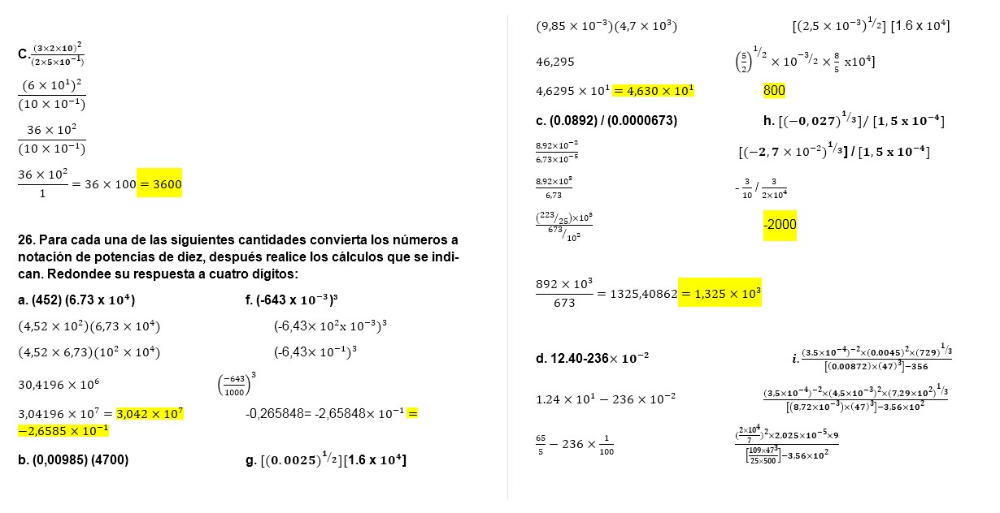
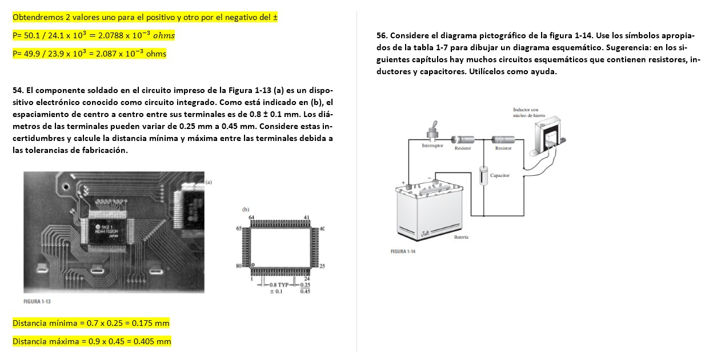
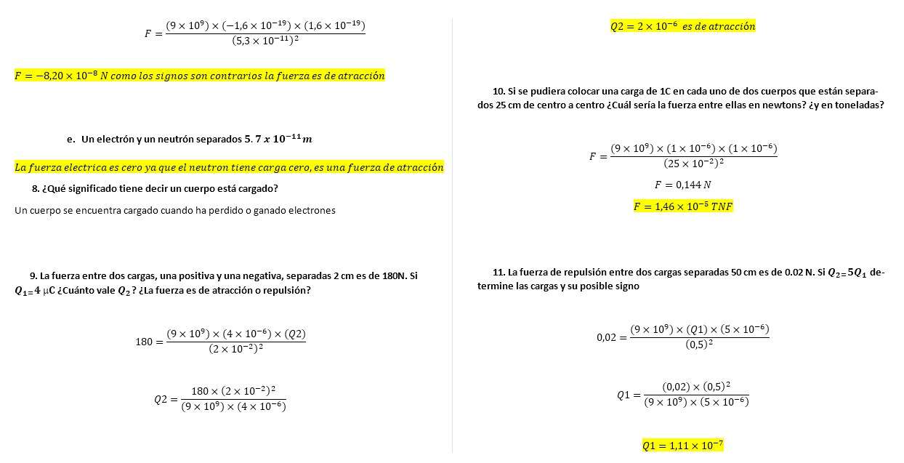
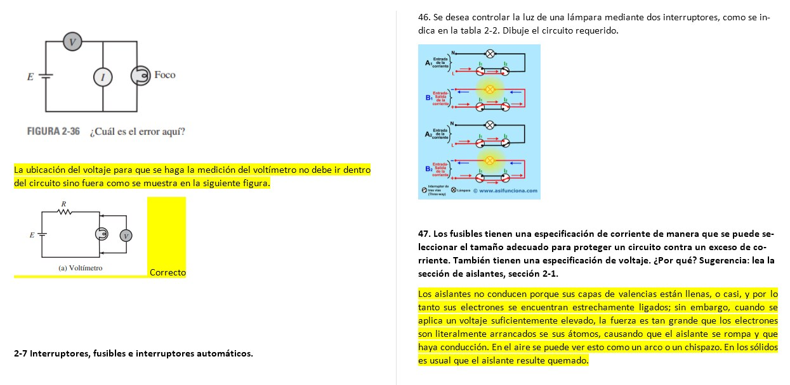

# InformeTarea1
==========================
## DEBER CAPITULOS 1 Y 2
1. OBJETIVOS
* 1.1. OBJETIVO GENERAL

Aprender de forma teórica conceptos de conversión de sistema de unidades y cálculo de voltaje y corriente eléctrica que se presentan en circuitos, para ello se pone en práctica por medio de resolución de problemas en los cuales influyen los conceptos de medición de voltaje y corriente como también se aplica los prefijos, notación de ingeniería y resultados numérico.

* 1.2. OBJETIVOS ESPECÍFICOS
  *	Aplicar conceptos de voltaje y resistencia 
  *	Aprender a calcular voltajes y corrientes eléctricas.
  *	Utilizar abreviaturas de sistema de medidas, voltajes y corrientes eléctricas
  *	Resolver ejercicios para mejorar y aumentar conceptos de sistema de unidades y  de voltaje y corriente eléctrica

2. MARCO TEÓRICO (RESUMEN)

3. EXPLICACIÓN Y RESOLUCIÓN DE EJERCICIOS O PROBLEMAS

4. VIDEO

https://www.youtube.com/watch?v=b-gR2CHaFyk

5. CONCLUSIONES

El trabajo realizado para la resolución del deber ha sido muy provechosa por varias razones, las cuales se resumen en esta conclusión. En primer lugar, se ha practicado el uso de conceptos de voltaje y de corriente, que es algo muy importante y que seguirá siendo provechoso en nuevas prácticas que se realicen en el futuro.
Los conocimientos sobre la simbología y las abreviaturas  fueron llevados a la práctica y se ha observado cómo se puede expresar los valores calculados en distintas manera  y cumple perfectamente siempre que se tome en cuenta las mediciones y transformaciones del sistema de unidades  
También se pudo ampliar los conceptos  de voltajes y corrientes eléctricas y a establecer relaciones entre estos valores en base a los ejercicios con los que se están trabajando en este deber.
Un aprendizaje muy valioso que se obtuvo de este trabajo es que se tiene la forma en que se aplicaron los conceptos y propiedades que nos brindó el libro de Análisis de Circuitos de los capítulos 1 y 2 que fueron comprobadas, por medio de la resolución de los ejercicios.
Se ha cumplido con los objetivos propuestos para este trabajo, y se desea que este reporte sea de provecho para aquellos que próximamente aplique sus conceptos de simbología de medición, voltajes y corrientes eléctricas

6. BIBLIOGRAFÍA

 *	Allan.H.Wilhelm.C.(2008). Análisis de circuitos teoría y práctica. Santa Fe, México: Cengage learning editores.

